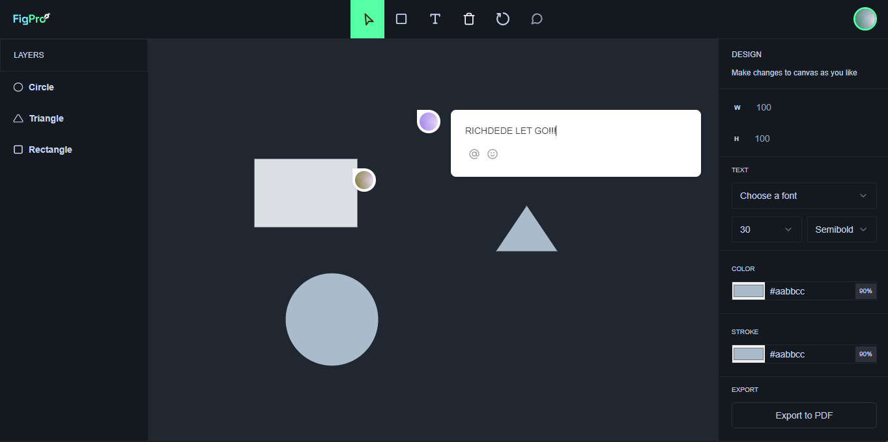

<div align="center">
  
[](https://twitter.com/intent/follow?screen_name=iamt_toby)
[](https://github.com/richdede)
[](https://www.linkedin.com/in/dee-prince-dede-970913217/)
[](https://www.instagram.com/iamt_toby/)


  <div>
    
    
    
  </div>

  <br />
  <br />

  <h2 align="center">Real Time Figma Clone</h2>

<a href="https://figma-clone-liveblocks.vercel.app/"><strong>➥ Live Demo</strong></a>

</div>

<br />

### Demo Screeshots



## 📋 <a name="table">Table of Contents</a>

1. 🤖 [Introduction](#introduction)
2. ⚙️ [Tech Stack](#tech-stack)
3. 🔋 [Features](#features)
4. 🤸 [Quick Start](#quick-start)
5. 🕸️ [Snippets](#snippets)
6. 🔗 [Links](#links)
7. 🚀 [More](#more)

## <a name="introduction">🤖 Introduction</a>

A minimalistic Figma clone to show how to add real-world features like live collaboration with cursor chat, comments, reactions, and drawing designs (shapes, image upload) on the canvas using fabric.js.

If you're getting started and need assistance or face any bugs, contact me!

## <a name="tech-stack">⚙️ Tech Stack</a>

- Next.js
- TypeScript
- Liveblocks
- Fabric.js
- Shadcn
- Tailwind CSS

## <a name="features">🔋 Features</a>

👉 **Multi Cursors, Cursor Chat, and Reactions**: Allows multiple users to collaborate simultaneously by showing individual cursors, enabling real-time chat, and reactions for interactive communication.

👉 **Active Users**: Displays a list of currently active users in the collaborative environment, providing visibility into who is currently engaged.

👉 **Comment Bubbles**: Enables users to attach comments to specific elements on the canvas, fostering communication and feedback on design components.

👉 **Creating Different Shapes**: Provides tools for users to generate a variety of shapes on the canvas, allowing for diverse design elements

👉 **Uploading Images**: Import images onto the canvas, expanding the range of visual content in the design

👉 **Customization**: Allows users to adjust the properties of design elements, offering flexibility in customizing and fine-tuning visual components

👉 **Freeform Drawing**: Enables users to draw freely on the canvas, promoting artistic expression and creative design.

👉 **Undo/Redo**: Provides the ability to reverse (undo) or restore (redo) previous actions, offering flexibility in design decision-making

👉 **Keyboard Actions**: Allows users to utilize keyboard shortcuts for various actions, including copying, pasting, deleting, and triggering shortcuts for features like opening cursor chat, reactions, and more, enhancing efficiency and accessibility.

👉 **History**: Review the chronological history of actions and changes made on the canvas, aiding in project management and version control.

👉 **Deleting, Scaling, Moving, Clearing, Exporting Canvas**: Offers a range of functions for managing design elements, including deletion, scaling, moving, clearing the canvas, and exporting the final design for external use.

and many more, including code architecture, advanced react hooks, and reusability 

## <a name="quick-start">🤸 Quick Start</a>

Follow these steps to set up the project locally on your machine.

**Prerequisites**

Make sure you have the following installed on your machine:

- [Git](https://git-scm.com/)
- [Node.js](https://nodejs.org/en)
- [npm](https://www.npmjs.com/) (Node Package Manager)

**Cloning the Repository**

```bash
git clone https://github.com/richdede/FigPro.git
cd FigPro
```

**Installation**

Install the project dependencies using npm:

```bash
npm install
```

**Set Up Environment Variables**

Create a new file named `.env.local` in the root of your project and add the following content:

```env
NEXT_PUBLIC_LIVEBLOCKS_PUBLIC_KEY=
```

Replace the placeholder values with your actual Liveblocks credentials. You can obtain these credentials by signing up on the [Liveblocks website](https://liveblocks.io).

**Running the Project**

```bash
npm run dev
```

Open [http://localhost:3000](http://localhost:3000) in your browser to view the project.